<picture>
  <source media="(prefers-color-scheme: dark)" srcset="assets/banner-dark.svg">
  <source media="(prefers-color-scheme: light)" srcset="assets/banner-light.svg">
  
</picture>

  

[joseorlando.dev](https://joseorlando.dev) &nbsp;&nbsp;|&nbsp;&nbsp; [LinkedIn](https://www.linkedin.com/in/joperezcf) &nbsp;&nbsp;|&nbsp;&nbsp; [CV (PDF)](https://joseorlando.dev/Jose-Orlando-CV.pdf)

## Hi, I'm Jose

I'm a software engineer at [Payabli](https://www.payabli.com), where I build embedded payment widgets, merchant dashboards and reporting interfaces for software platforms.

- My home is the UI: making complex financial tools feel fast, clear and accessible with React and TypeScript.
- I'm just as comfortable on the other side, shipping features with .NET, C# and PostgreSQL.
- I've been writing software professionally since 2015.

## Stack

  

## Contributions

  

Most of my work lives in private repositories at Payabli, so it shows up here as contribution counts only.

